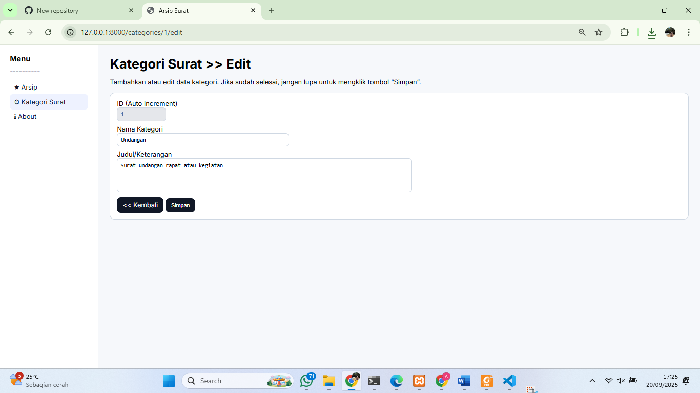
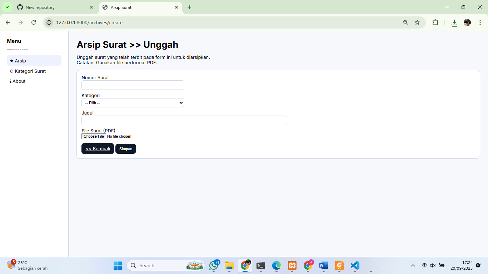
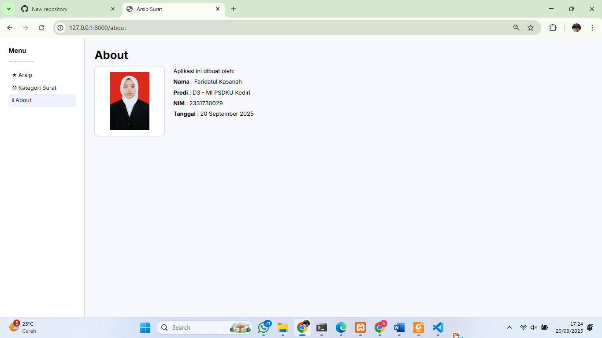
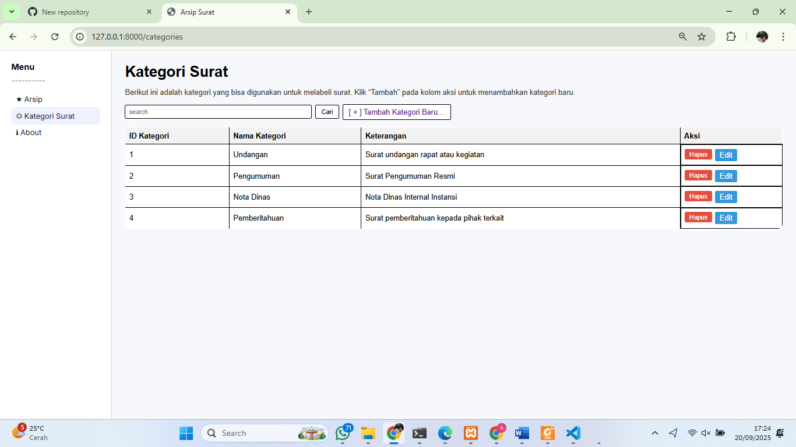
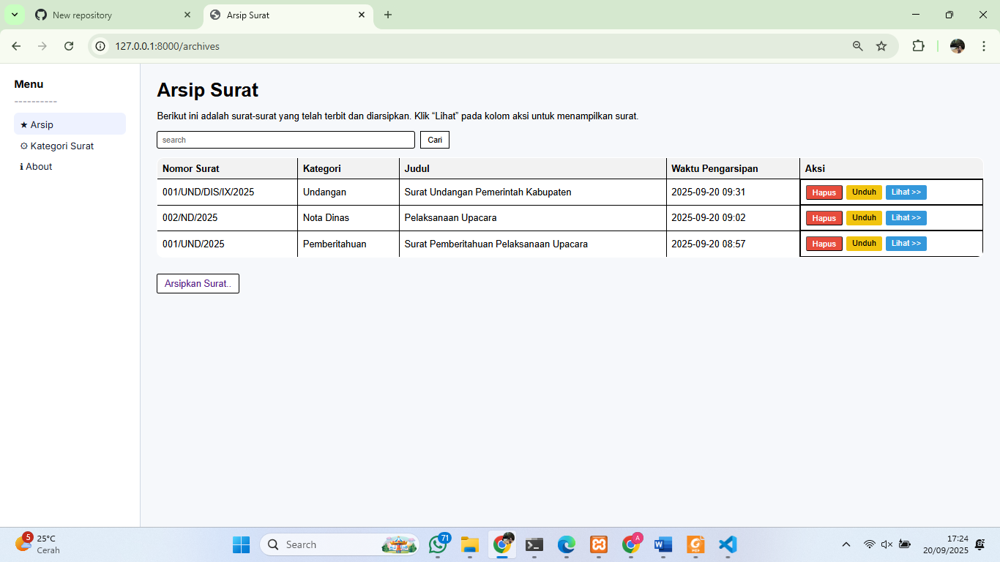
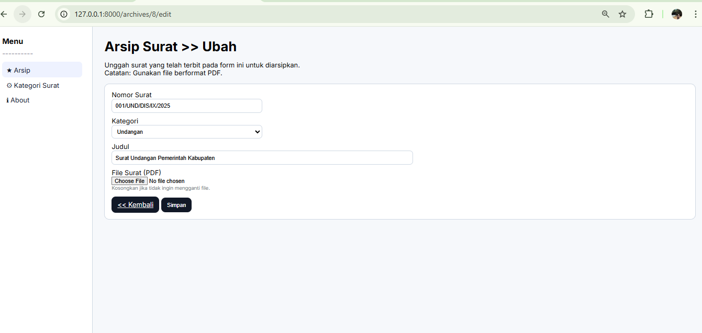

# 📂 Aplikasi Arsip Surat

Aplikasi Arsip Surat adalah sebuah sistem berbasis web yang dibangun dengan **Laravel** untuk mengelola surat masuk dan surat keluar secara digital.  
Tujuannya adalah mempermudah proses penyimpanan, pencarian, dan pengarsipan dokumen surat.

---

## 🎯 Tujuan
- Membantu instansi/organisasi dalam mengelola arsip surat.  
- Menyediakan sistem pencarian cepat berdasarkan kata kunci.  
- Mengurangi penggunaan arsip fisik.

---

## 🚀 Fitur Utama 
- CRUD Data Surat (tambah, edit, hapus, lihat).  
- Upload & download file surat (PDF).  
- Pencarian surat berdasarkan kata kunci.  
 

---

## 🛠️ Teknologi
- **Framework**: Laravel  
- **Bahasa Pemrograman**: PHP, JavaScript  
- **Database**: MySQL  
- **Frontend**: Blade Template, Bootstrap  
- **Tools**: Composer, Artisan CLI  

---

## ⚙️ Cara Menjalankan (Localhost)
1. Clone repository ini:
   ```bash
   git clone https://github.com/frdaatul/aplikasi_arsipsurat.git

## 📸 Screenshot Aplikasi

### 📝 Halaman Edit


### 📤 Halaman Unggah


### 👀 Halaman Lihat


### ℹ️ Halaman About


### 📂 Halaman Kategori


### 📑 Halaman Arsip


### 📑 Halaman Arsipubah



